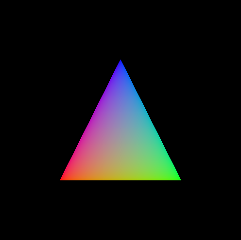

# Dunge

<div align="center">
    <p>
        Simple and portable 3d render based on <a href="https://github.com/gfx-rs/wgpu">WGPU</a>.
    </p>
    <p>
        <a href="https://crates.io/crates/dunge"></img></a>
        <a href="https://docs.rs/dunge"></img></a>
    </p>
</div>

## Features
* Simple but flexible API
* Desktop, WASM and Android (WIP) support
* Pixel perfect render with custom layers
* Texture and color vertex modes
* Primitives for object positioning and camera view out of the box

## Application area
The library is for personal use only. I use it to create my applications and I make API suitable exclusively for my problems. Perhaps in the future API will settle down and the library will be self-sufficient for other applications.

## Getting Started
Let's render a colorful triangle for example. First, we need to add the dependency of dunge in the `Cargo.toml`:
```
cargo add dunge
```

Then, let's create a new window to draw something in it:
```rust
// Import some types
use dunge::{
    color::Standard,
    handles::*,
    input::{Input, Key},
    transform::Position,
    vertex::ColorVertex,
    CanvasConfig, Context, Error, Frame, InitialState, Loop, MeshData, Perspective, View,
    WindowMode,
};

fn main() {
    dunge::make_window(InitialState::default())
        .run_blocking(CanvasConfig::default(), App::new)
        .into_panic();
}
```

`make_window` creates a new instance of `Canvas` type and sets up window properties, it allows us to handle an input from users. `run_blocking` runs our application by calling the constructor of it and passes the `Context` object there. Context uses for creation and updating of meshes, textures, views, instances etc.

The `App` is our application type, we need to create it:
```rust
struct App {
    layer: LayerHandle<ColorVertex>,
    instance: InstanceHandle,
    mesh: MeshHandle<ColorVertex>,
    view: ViewHandle,
}

impl App {
    fn new(context: &mut Context) -> Self {
        // Create new layer for `ColorVertex`. The vertex type inferred from the context
        let layer = context.create_layer();

        // Create a model instance
        let instance = context.create_instances([Position::default()]);

        // Create a mesh
        let mesh = {
            // Vertex data describes a position in XYZ coordinates and color in RGB per vertex:
            const VERTICES: [ColorVertex; 3] = [
                ColorVertex { pos: [-0.5, -0.5, 0.], col: [1., 0., 0.] },
                ColorVertex { pos: [ 0.5, -0.5, 0.], col: [0., 1., 0.] },
                ColorVertex { pos: [ 0.,   0.5, 0.], col: [0., 0., 1.] },
            ];
            let data = MeshData::from_verts(&VERTICES);
            context.create_mesh(&data)
        };

        // Create the view
        let view = context.create_view::<Perspective>(View::default());
        Self { layer, instance, mesh, view }
    }
}
```

To be able to pass the `App` in `run_blocking` we need to implement a `Loop` trait for it:
```rust
impl Loop for App {
    type Error = Error; // Define the error type

    // This calls once before every `render`
    fn update(&mut self, context: &mut Context, input: &Input) -> Result<(), Self::Error> {
        // You can update the context here. For example create and delete meshes.
        // Also you may want to handle an user's input here.
        Ok(())
    }

    // This calls every time the application needs to draw something in the window
    fn render(&self, frame: &mut Frame) -> Result<(), Self::Error> {
        // Draw a new layer
        let mut layer = frame
            .layer(self.layer)?
            .with_clear_color(Standard([0, 0, 0, u8::MAX]))
            .with_clear_depth()
            .start();

        layer.bind_view(self.view)?;
        layer.bind_instance(self.instance)?;
        layer.draw(self.mesh)
    }
}
```

Finally, let's run our code:
```
cargo run
```

Now you should see something like this:



## Examples
See [examples](https://github.com/nanoqsh/dunge/tree/main/examples) directory for more examples.
To build and run an example do:
```
cargo r -p <example_name>
```
